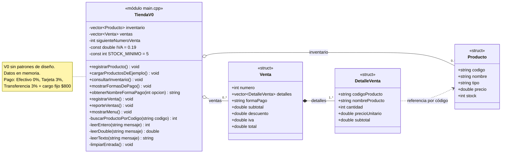

## Diagrama UML - Versión 0

```mermaid
classDiagram
    direction LR

    class Producto {
        <<struct>>
        +string codigo
        +string nombre
        +string tipo
        +double precio
        +int stock
    }

    class DetalleVenta {
        <<struct>>
        +string codigoProducto
        +string nombreProducto
        +int cantidad
        +double precioUnitario
        +double subtotal
    }

    class Venta {
        <<struct>>
        +int numero
        +vector~DetalleVenta~ detalles
        +string formaPago
        +double subtotal
        +double descuento
        +double iva
        +double total
    }

    class TiendaV0 {
        <<módulo main.cpp>>
        -vector~Producto~ inventario
        -vector~Venta~ ventas
        -int siguienteNumeroVenta
        -const double IVA = 0.19
        -const int STOCK_MINIMO = 5
        +registrarProducto() void
        +cargarProductosDeEjemplo() void
        +consultarInventario() void
        +mostrarFormasDePago() void
        +obtenerNombreFormaPago(int opcion) string
        +registrarVenta() void
        +reporteVentas() void
        +mostrarMenu() void
        -buscarProductoPorCodigo(string codigo) int
        -leerEntero(string mensaje) int
        -leerDouble(string mensaje) double
        -leerTexto(string mensaje) string
        -limpiarEntrada() void
    }

    TiendaV0 o-- "0..*" Producto : inventario
    TiendaV0 o-- "0..*" Venta : ventas
    Venta *-- "1..*" DetalleVenta : detalles
    DetalleVenta ..> Producto : referencia por código

    note for TiendaV0 "V0 sin patrones de diseño.
Datos en memoria.
Pago: Efectivo 0%, Tarjeta 3%,
Transferencia 3% + cargo fijo $800"
```
