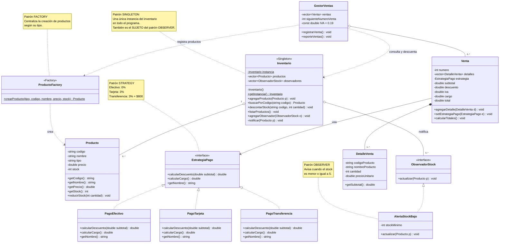

## Diagrama UML - Versión con patrones de diseño

```mermaid
classDiagram
    direction TB

    %% ===== FACTORY =====
    class ProductoFactory {
        <<Factory>>
        +crearProducto(tipo, codigo, nombre, precio, stock)$ Producto
    }

    class Producto {
        -string codigo
        -string nombre
        -string tipo
        -double precio
        -int stock
        +getCodigo() string
        +getNombre() string
        +getPrecio() double
        +getStock() int
        +reducirStock(int cantidad) void
    }

    %% ===== SINGLETON + OBSERVER (sujeto) =====
    class Inventario {
        <<Singleton>>
        -Inventario instancia$
        -vector~Producto~ productos
        -vector~ObservadorStock~ observadores
        -Inventario()
        +getInstancia()$ Inventario
        +agregarProducto(Producto p) void
        +buscarPorCodigo(string codigo) Producto
        +descontarStock(string codigo, int cantidad) void
        +listarProductos() void
        +agregarObservador(ObservadorStock o) void
        -notificar(Producto p) void
    }

    class ObservadorStock {
        <<interface>>
        +actualizar(Producto p) void
    }

    class AlertaStockBajo {
        -int stockMinimo
        +actualizar(Producto p) void
    }

    %% ===== STRATEGY =====
    class EstrategiaPago {
        <<interface>>
        +calcularDescuento(double subtotal) double
        +calcularCargo() double
        +getNombre() string
    }

    class PagoEfectivo {
        +calcularDescuento(double subtotal) double
        +calcularCargo() double
        +getNombre() string
    }

    class PagoTarjeta {
        +calcularDescuento(double subtotal) double
        +calcularCargo() double
        +getNombre() string
    }

    class PagoTransferencia {
        +calcularDescuento(double subtotal) double
        +calcularCargo() double
        +getNombre() string
    }

    %% ===== VENTAS =====
    class DetalleVenta {
        -string codigoProducto
        -string nombreProducto
        -int cantidad
        -double precioUnitario
        +getSubtotal() double
    }

    class Venta {
        -int numero
        -vector~DetalleVenta~ detalles
        -EstrategiaPago estrategia
        -double subtotal
        -double descuento
        -double iva
        -double cargo
        -double total
        +agregarDetalle(DetalleVenta d) void
        +setEstrategiaPago(EstrategiaPago e) void
        +calcularTotales() void
    }

    class GestorVentas {
        -vector~Venta~ ventas
        -int siguienteNumeroVenta
        -const double IVA = 0.19
        +registrarVenta() void
        +reporteVentas() void
    }

    %% ===== RELACIONES =====
    ProductoFactory ..> Producto : crea
    Inventario "1" o-- "0..*" Producto
    Inventario o-- "0..*" ObservadorStock : notifica
    ObservadorStock <|.. AlertaStockBajo

    EstrategiaPago <|.. PagoEfectivo
    EstrategiaPago <|.. PagoTarjeta
    EstrategiaPago <|.. PagoTransferencia

    Venta --> EstrategiaPago : usa
    Venta *-- "1..*" DetalleVenta
    GestorVentas o-- "0..*" Venta
    GestorVentas ..> Inventario : consulta y descuenta
    GestorVentas ..> ProductoFactory : registra productos

    note for ProductoFactory "Patrón FACTORY<br/>Centraliza la creación de productos<br/>según su tipo."
    note for Inventario "Patrón SINGLETON<br/>Una única instancia del inventario<br/>en todo el programa.<br/>También es el SUJETO del patrón OBSERVER."
    note for AlertaStockBajo "Patrón OBSERVER<br/>Avisa cuando el stock<br/>es menor o igual a 5."
    note for EstrategiaPago "Patrón STRATEGY<br/>Efectivo: 0%<br/>Tarjeta: 3%<br/>Transferencia: 3% + $800"
```
