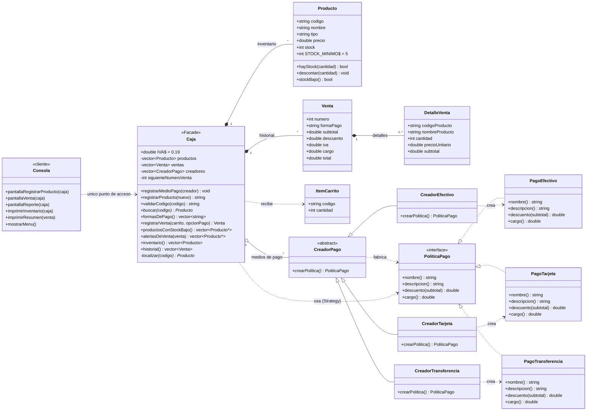

```mermaid
classDiagram
    direction LR

    %% ===== MODELO =====
    class Producto {
        +string codigo
        +string nombre
        +string tipo
        +double precio
        +int stock
        +int STOCK_MINIMO$ = 5
        +hayStock(cantidad) bool
        +descontar(cantidad) void
        +stockBajo() bool
    }

    class DetalleVenta {
        +string codigoProducto
        +string nombreProducto
        +int cantidad
        +double precioUnitario
        +double subtotal
    }

    class Venta {
        +int numero
        +string formaPago
        +double subtotal
        +double descuento
        +double iva
        +double cargo
        +double total
    }

    class ItemCarrito {
        +string codigo
        +int cantidad
    }

    %% ===== STRATEGY =====
    class PoliticaPago {
        <<interface>>
        +nombre() string
        +descripcion() string
        +descuento(subtotal) double
        +cargo() double
    }

    class PagoEfectivo {
        +nombre() string
        +descripcion() string
        +descuento(subtotal) double
        +cargo() double
    }

    class PagoTarjeta {
        +nombre() string
        +descripcion() string
        +descuento(subtotal) double
        +cargo() double
    }

    class PagoTransferencia {
        +nombre() string
        +descripcion() string
        +descuento(subtotal) double
        +cargo() double
    }

    %% ===== FACTORY METHOD =====
    class CreadorPago {
        <<abstract>>
        +crearPolitica() PoliticaPago*
    }

    class CreadorEfectivo {
        +crearPolitica() PoliticaPago
    }

    class CreadorTarjeta {
        +crearPolitica() PoliticaPago
    }

    class CreadorTransferencia {
        +crearPolitica() PoliticaPago
    }

    %% ===== FACADE =====
    class Caja {
        <<Facade>>
        +double IVA$ = 0.19
        -vector~Producto~ productos
        -vector~Venta~ ventas
        -vector~CreadorPago~ creadores
        -int siguienteNumeroVenta
        +registrarMedioPago(creador) void
        +registrarProducto(nuevo) string
        +validarCodigo(codigo) string
        +buscar(codigo) Producto*
        +formasDePago() vector~string~
        +registrarVenta(carrito, opcionPago) Venta
        +productosConStockBajo() vector~Producto*~
        +alertasDeVenta(venta) vector~Producto*~
        +inventario() vector~Producto~
        +historial() vector~Venta~
        -localizar(codigo) Producto*
    }

    class Consola {
        <<cliente>>
        +pantallaRegistrarProducto(caja)
        +pantallaVenta(caja)
        +pantallaReporte(caja)
        +imprimirInventario(caja)
        +imprimirResumen(venta)
        +mostrarMenu()
    }

    %% ===== RELACIONES =====
    %% Strategy
    PoliticaPago <|.. PagoEfectivo
    PoliticaPago <|.. PagoTarjeta
    PoliticaPago <|.. PagoTransferencia

    %% Factory Method
    CreadorPago <|-- CreadorEfectivo
    CreadorPago <|-- CreadorTarjeta
    CreadorPago <|-- CreadorTransferencia
    CreadorEfectivo ..> PagoEfectivo : crea
    CreadorTarjeta ..> PagoTarjeta : crea
    CreadorTransferencia ..> PagoTransferencia : crea
    CreadorPago ..> PoliticaPago : fabrica

    %% Facade
    Caja "1" o-- "*" CreadorPago : medios de pago
    Caja "1" *-- "*" Producto : inventario
    Caja "1" *-- "*" Venta : historial
    Caja ..> PoliticaPago : usa (Strategy)
    Caja ..> ItemCarrito : recibe

    %% Modelo
    Venta "1" *-- "1..*" DetalleVenta : detalles

    %% Cliente
    Consola ..> Caja : unico punto de acceso
```
